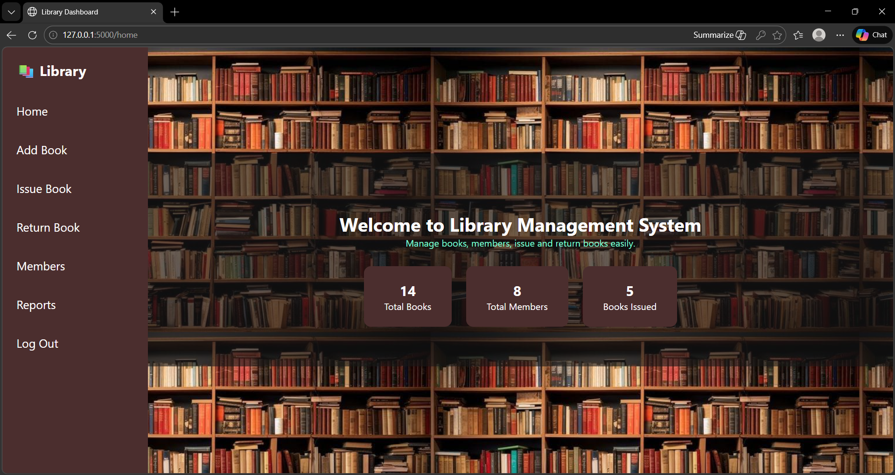
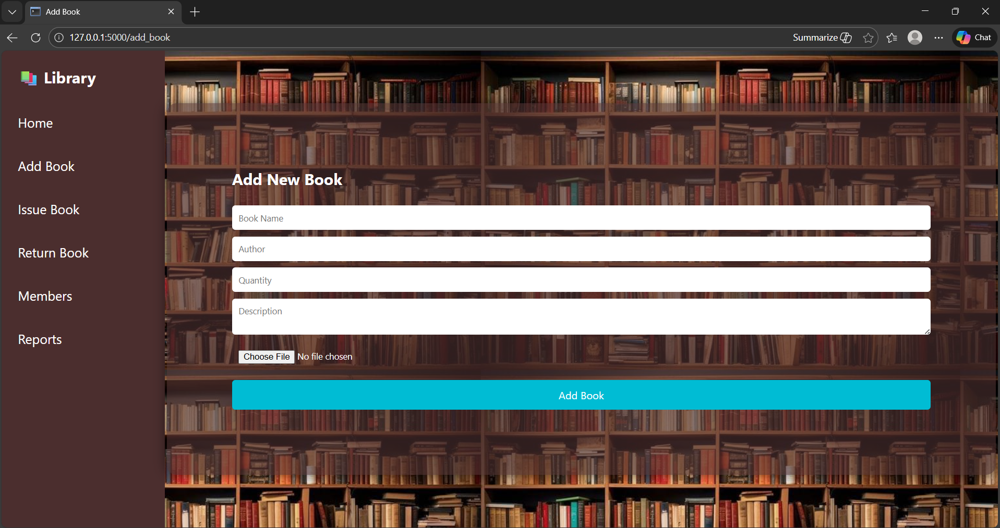
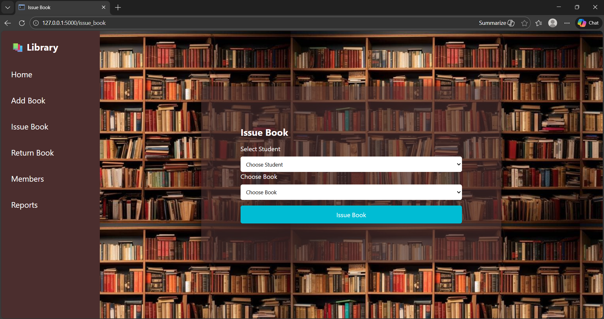
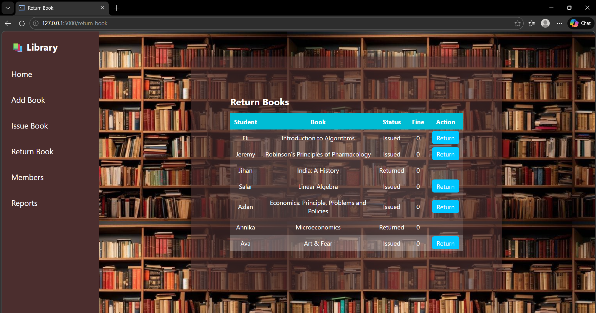
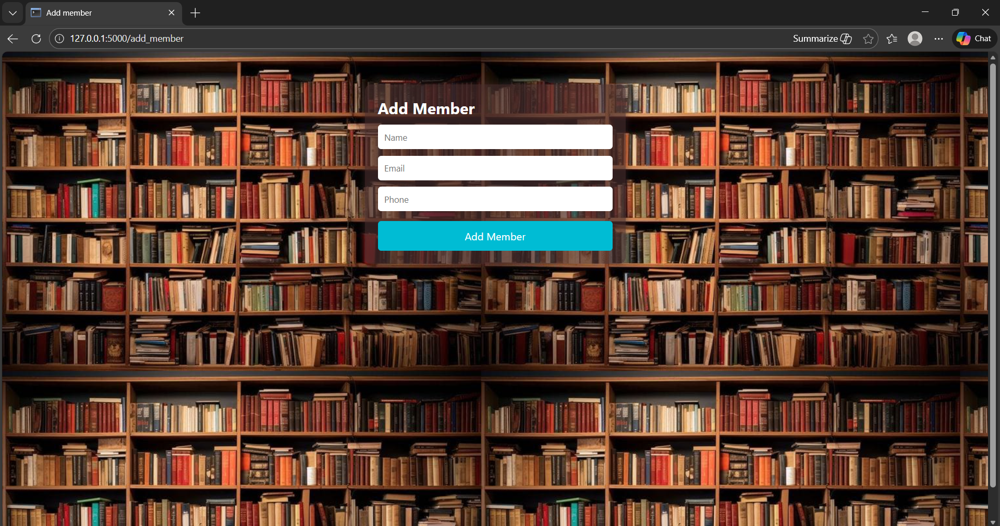
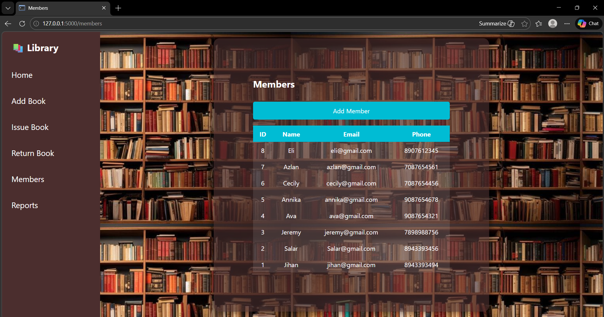
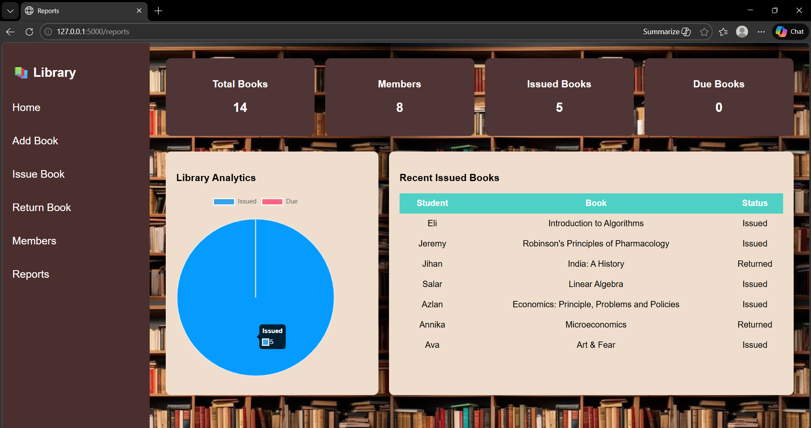

#  Library Management System

A modern ""Library Management System"" built using ""Python, Flask, SQLite, HTML, and CSS"". This application helps manage books, members, book issuing, returns, and reports with a clean and professional dashboard interface.

---

##  Features

###  Book Management

* Add new books
* Track available quantity
* View total books

###  Member Management

* Add new members
* Store email and phone details
* View all members

###  Issue Book

* Issue books to members
* Automatically reduce book quantity
* Store issue date and return date

###  Return Book

* Return issued books
* Automatically increase quantity
* Calculate fine for late returns

###  Reports Dashboard

* Total books
* Total members
* Issued books count
* Available books count

###  Modern UI

* Professional sidebar navigation
* Modern dashboard design
* Clean and responsive interface
* SaaS-style layout

---

##  Technologies Used

* Python
* Flask
* SQLite
* HTML5
* CSS3
* Jinja2

---

##  Project Structure

```
library_management/
│
├── app.py
├── database.db
│
├── templates/
│   ├── home.html
│   ├── add_book.html
│   ├── issue_book.html
│   ├── return_book.html
│   ├── members.html
│   ├── add_member.html
│   └── reports.html
│
├── static/
│   └── css/
│       └── style.css
│
└── README.md
```

---

##  Installation and Setup

### Step 1: Install Python

Download Python from
[https://python.org](https://python.org)

---

### Step 2: Install Flask

Open terminal and run:

```bash
pip install flask
```

---

### Step 3: Run the application

```bash
python app.py
```

---

### Step 4: Open in browser

```
http://127.0.0.1:5000
```

---

### Screenshots

# Home


# Add book


# Issue Book


# Return Book


# Add Member


# Member List


# Report


### Home page

* Modern sidebar
* Book statistics
* Clean UI

### Members Page

* Add members
* View members list

### Issue & Return System

* Issue books
* Return books
* Fine calculation

---

## Purpose of Project

This project was developed to demonstrate skills in:

* Python programming
* Flask web development
* Database management
* Frontend UI design
* CRUD operations

---

##  Author

**Mahek Khan**

* Python Developer
* Interested in AI, Data Analysis, and Software Development

---

##  Future Improvements

* Login system
* Admin authentication
* Search functionality
* Book categories


